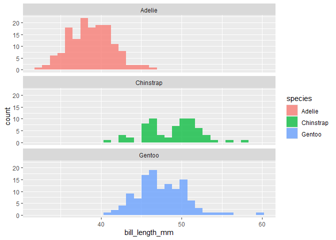
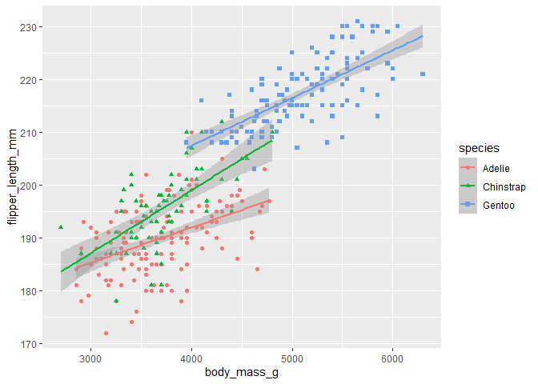
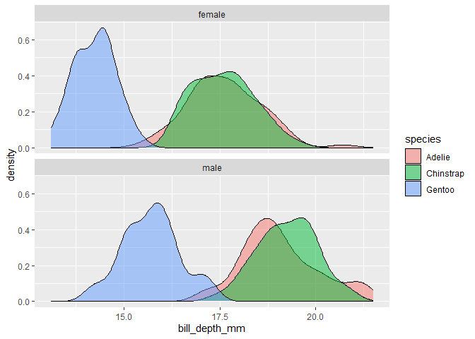
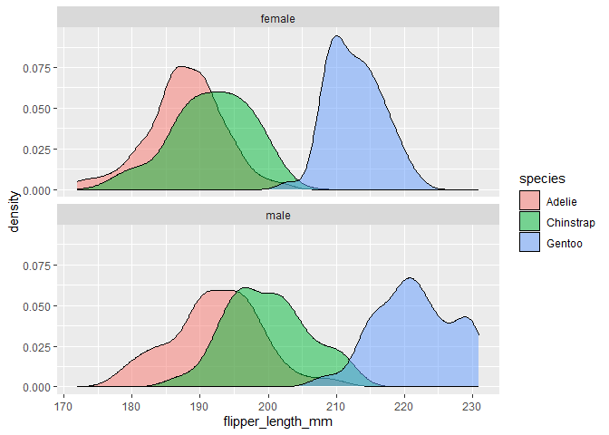
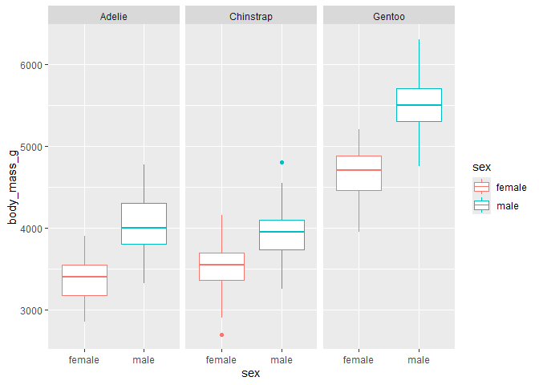

Penguins
================
hopper
2024-09-12

## Data

Today we are using data collected and made available by [Dr Kristen
Gorman](https://www.uaf.edu/cfos/people/faculty/detail/kristen-gorman.php)
and the [Palmer Station](https://pallter.marine.rutgers.edu/). The
dataset contains information on 344 individuals of 3 species of penguin.

<figure>

<figcaption aria-hidden="true">The three species of penguin that were
used in the creation of this dataset.</figcaption>
</figure>

 

## Single trait distribution

First, we will plot out the distribution of the bill length of each
species. Note that some bill lengths overlap.

<!-- -->

 

## Relationship between multiple traits

An exploration of the relationship between body size (mass, in g) and
flipper size (length, mm). Different species are indicated.

<!-- -->

 

## Sexual dimorphism

Let’s take a look at sexually dimorphic traits across the three species.

First, bill depth:

<!-- -->

Additionally, we can look at flipper length:

<!-- -->

On a visual inspection of the two plots, bill depth appears to be a
sexually dimorphic trait in all three species, with males having deeper
bills than females. Flipper length, by comparison, is more strongly
sexually dimorphic in Gentoo penguins than in Adelie and Chinstrap
penguins.

Finally, let us look at whether body mass is sexually dimorphic:

<!-- -->
